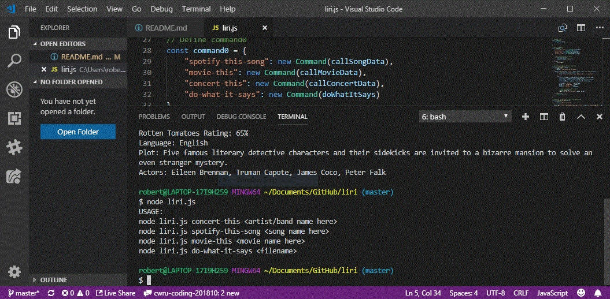
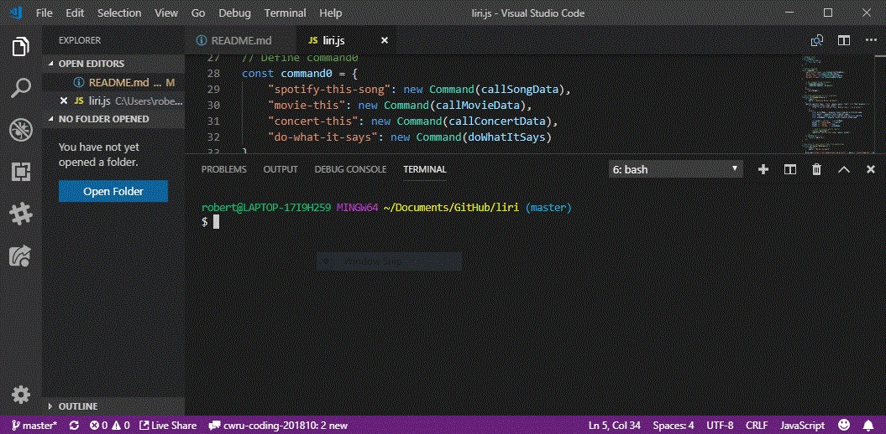
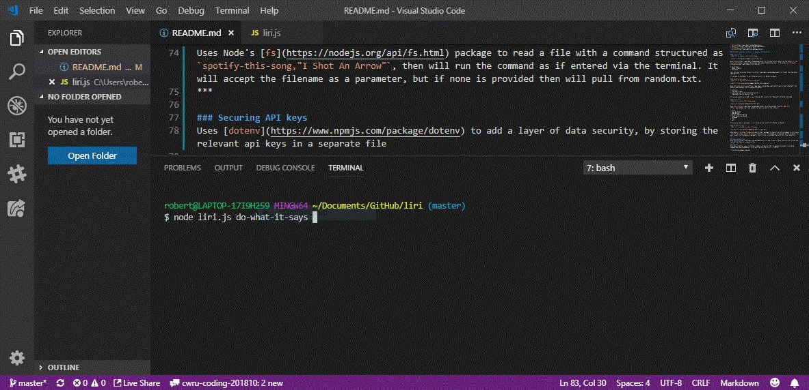
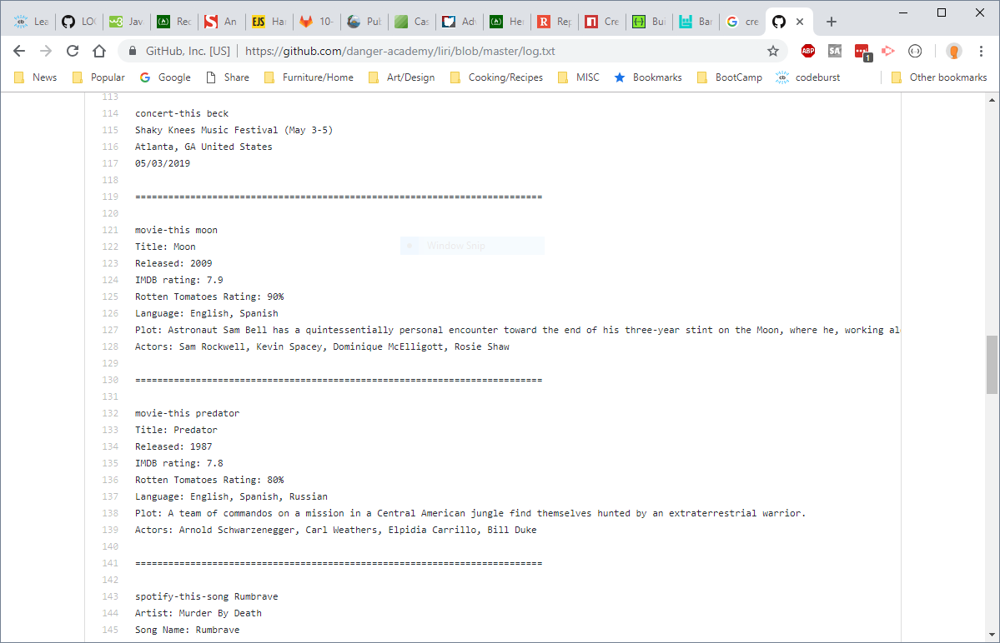

## LIRI
LIRI is a command-line interface (CLI) which accepts properly formatted queries and returns the relevant data.

### Challenges
Reading through all of the API documentation took a fair amount of time. It also took a few run-throughs to get the npm packages properly installed. 
***

### APIs used:
* [Spotify](https://developer.spotify.com/documentation/web-api/)
* [Bands in Town Events API](https://manager.bandsintown.com/support/bandsintown-api)
* [OMDb API](http://www.omdbapi.com/)

### Packages used: 
* [node-spotify-api](https://www.npmjs.com/package/node-spotify-api)
* [Axios](https://www.npmjs.com/package/axios)
* [Moment.js](https://www.npmjs.com/package/moment)
* [fs](https://nodejs.org/api/fs.html)
* [dotenv](https://www.npmjs.com/package/dotenv)

### Terminal Commands (with gifs to display functionality)

#### concert-this
`node liri.js concert-this <artist/band>`

Uses [Axios](https://www.npmjs.com/package/axios) to retrieve concert data from the [Bands in Town Events API](https://manager.bandsintown.com/support/bandsintown-api). It displays the following information about each show in the terminal:

* Venue name
* Venue location
* Show date

This function also uses [Moment.js](https://www.npmjs.com/package/moment) to format the show date (MM//DD/YYYY).

If no band is provided, it will display results for Murder by Death.

#### spotify-this-song
`node liri.js spotify-this-song <song name>`

Uses the [node-spotify-api](https://www.npmjs.com/package/node-spotify-api) to get song data from Spotify and displays the following information:

* Artist(s)
* The song's name
* A preview link of the song from Spotify
* The album that the song is from

If no song name is provided, it will display the results for "Rumbrave" by Murder by Death.

#### movie-this
`node liri.js movie-this <movie name>`

Uses [Axios](https://www.npmjs.com/package/axios) to get movie data from the [OMDb API](http://www.omdbapi.com/) and outputs the movie's data to the terminal:

* Title
* Year produced
* IMDB Rating
* Rotten Tomatoes Rating
* Country where produced
* Language
* Plot
* Cast

If no movie name is provided, it will display the results for "Murder by Death".

#### do-what-it-says
`node liri.js do-what-it-says <filename>`

Uses Node's [fs](https://nodejs.org/api/fs.html) package to read a file with a command structured as `spotify-this-song,"I Shot An Arrow"`, then will run the command as if entered via the terminal. It will accept the filename as a parameter, but if none is provided then will pull from random.txt.
***

### Securing API keys
Uses [dotenv](https://www.npmjs.com/package/dotenv) to add a layer of data security, by storing the relevant api keys in a separate file 

### log.txt
As a bonus feature, uses [fs](https://nodejs.org/api/fs.html) to append the output (including command and search parameter) to a log file via `logToFile()`, like so:

